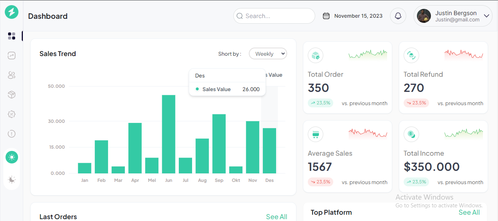
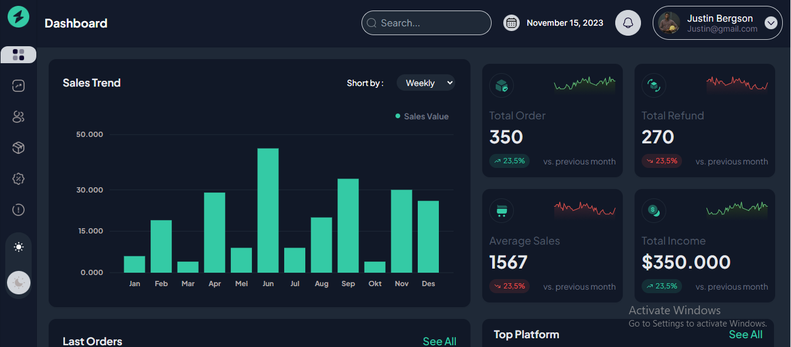
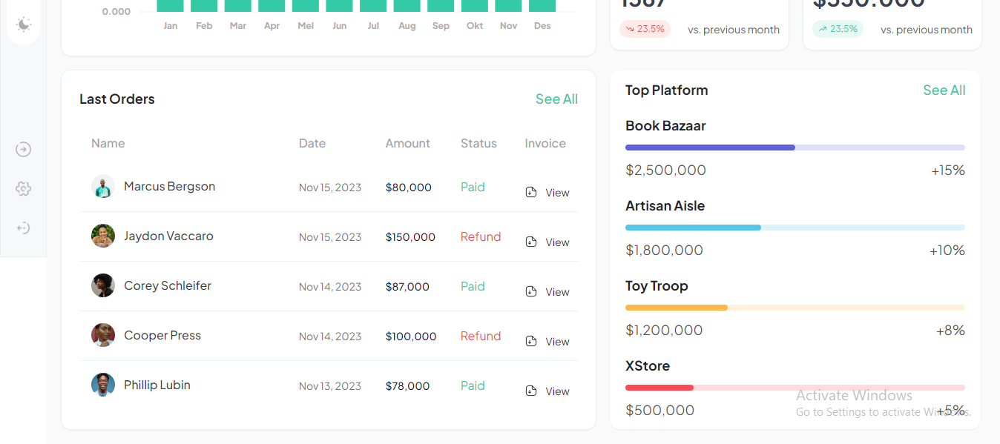
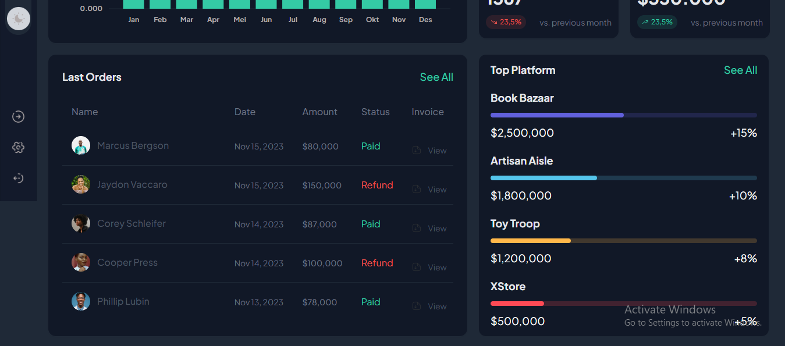

# Geepay's Analytic Dashboard Challenge With Vite,  Reactjs, Tremor and Tailwind CSS (Deployed with Vercel)

I'm an aspiring MERN developer, having spent 1yr+ with Reactjs, I was very excited when a friend recommended this challenge for me, it's a great way to flex my skills, Thank you Geepay! So below is the breakdown of my process.

### Screenshot

## INITIAL SETUP: 
- I used Vite to set up my development environment, it's light weight, and doesn't take time to set up. 
- I proceeded to GitHub to create a repository for the project.
- I added a vercel.json file, to enable live deployment with Vercel - I installed tailwind CSS, that's what I use for styling my pages
- I worked on my folder arrangement, at the end of the day it looked like this as seen on Figure 1. 
- I moved to the Figma file, imported and added all the icons and images required for the project. 
- Then to my demo.js where I added all the dummy data I'll need for the project, you can see that in Figure 2. 

I've always written my own CSS, only recently did I start using Material UI for a project, so looking at the nature of the dashboard, I started a search for a library that will easily fit the design of the dashboard, Material UI wasn't it, but I stumbled upon Tremor, and it turns out tremor supports Tailwind CSS, I was overjoyed! And I'll definitely start using it from now on!

- So I installed it using this command: ""
- I took some time to go through the documentation, I'd always say using a library is like learning a new language 😅

## ACTUAL DEVELOPMENT
- I started by adding the only page in the Page Folder, it's titled OverviewPage
- I added components for the Navigation, that is the NavBar, NavItems and TopBar components
- I also added components for each of the cards, that is the SalesTrend, Summary, LastOrders, TopPlatform components
- I added their HTML and styled them using tailwind CSS, some parts I didn't need to style, although I had to modify them, I used Tremors Card, Title, SubTitle, Table, and Bar Components

The Bar chart Tremor provides doesn't really correspond with the one in the Figma file 🥺🥺 I could find any library that's better than Tremor's in my opinion, so I stuck with it.

- I added some hover effects and animations as well
- I also added the light and dark theme functionality using vanilla js and js localStorage, on refresh of the page, it still retains the theme 😁
- I added tool tips for the nav bar hence the ToolTip Component
- I used the desktop first approach, so I worked on the responsiveness for Ipad and Mobile screen sizes

It's in doing we become, Thank you Geepay! I learnt a lot doing this challenge!
